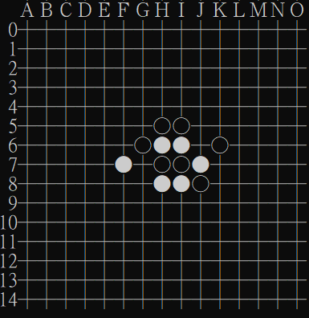

# Five-in-a-row AI Game
### Author: Hao-Jen Wang
### Date Done: November 2016
### Environment: Code::Blocks IDE, Windows 10

This game is created the course "Introduction to Intelligent Computing" (CS-460100) at National Tsing Hua University.

You can play five-in-a-row with a medium-level computer AI. Note that player can decide to play first by selecting "black" color.

The algorithm was implemented using minimax tree algorithm and was awarded a second place of the midterm competition.

**Add the option of "-fexec-charset=BIG-5" when compiling** to avoid gibberish.

The UI is shown in command line interface, and here is a sample screenshot of gameplay, where the black player is AI.

(Note that in some environment the chesses will be out-of-order.)

